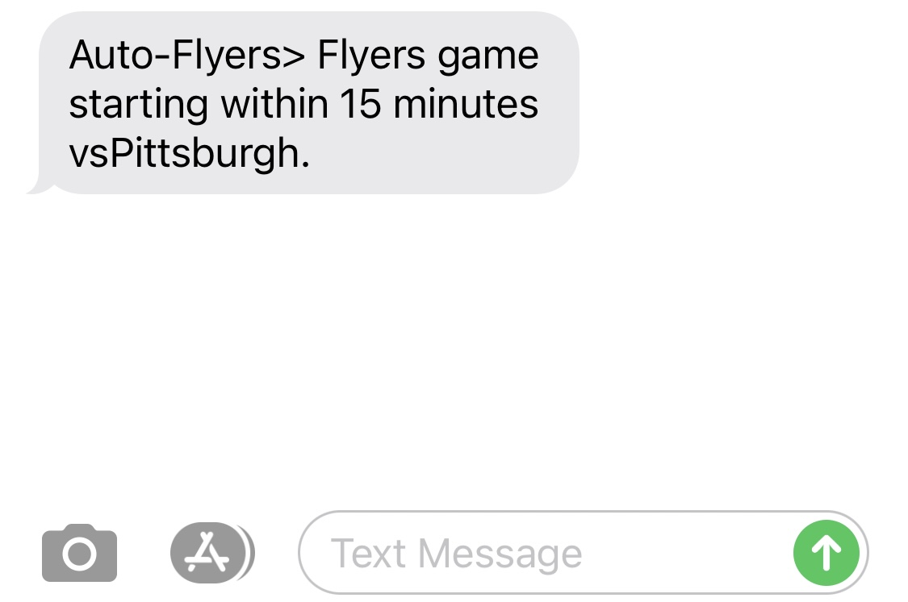

# Flyers-Auto-SMS
AWS SNS program to automatically notify subscribers for Flyers games

###Table of Contents
1. [Installation](#Installation)
2. [Components](#Components)
3. [Features](#Features)
4. [Related Repositories](#Related Repositories)

### **Installation**
Clone the repository
```bash
$ git clone https://github.com/connellboyce/Flyers-Auto-SMS.git
```
Navigate to the directory.
```bash
cd .../Flyers-Auto-SMS
```

Run the project through the Spring Boot plugin for Maven.
```bash
$ mvn spring-boot run
```

- This project will run on a local machine but will not function. Aside from needing AWS keys stored locally on my machine, its purpose is to send messages to a list of subscribers. This is designed to operate on one machine.


### **Components**
- Java 8
- Spring Boot 2.2.5
- Maven
- AWS SNS


### **Features**
- The purpose of the app is to send scheduled notifications to subscribed members. 
- Within 15 minutes of a Flyers game for the 2020 season, the app will send out a message such as this:


### **Related Repositories**
- This application was built with some modified files originally in my own repository:
  - [Web-App-Resume](https://github.com/connellboyce/Web-App-Resume)
- Both of these apps used a publicly available repository as a way to learn the workings of AWS SNS.
  - [spring-aws-sns-publisher](https://github.com/aldwindelgado/spring-aws-sns-publisher)